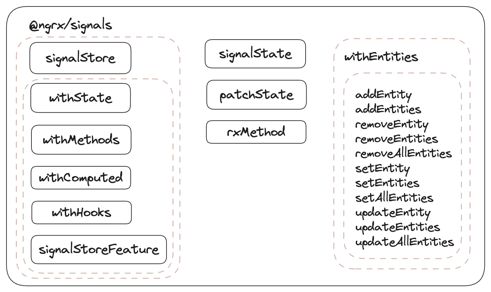

= Angualr Signal Store

== The Missing Piece to Signals

Signal Store is somewhat of a complete state management library.

NOTE: The @ngrx/signals package is in developer preview. It is ready to try, but may change before becoming stable.

== Is this integration any useful?
*** Angular is making a big push towards signals. This means developers can expect signals to become increasingly important for building modern Angular applications
*** Integrating a locally-scoped feature
*** Small library. It’s about 3.1kB minified, 1.2kB minified+gzipped.

=== Downsides
*** Can be challenging having different scoped stores
*** Increases the learning curve for new developers joining the project
*** Unit-testing will be more challenging as well

== Overview
You can create a store using the *signalStore* function. You can handle simple pieces of state using the *signalState*.
You can extend the core functionality with custom features using the *signalStoreFeature*.
You can integrate RxJS using the *rxMethod* and you can manage entities using the *withEntities* feature. That's it

==== Getting the Package

[source,typescript]
----

         ng add @ngrx/signals@latest
----

== Demo App
image:T2Mf13.gif[img_1.gif]

==== Creating a Store
[source,typescript]
----

const initialProductState: ProductState = {};

export const ProductStore = signalStore(
  {providedIn: 'root'},
  withDevtools('productCataloge'),
  withState(initialProductState),
  withComputed((store) => ({})),

  withMethods((store, productApiService = inject(ProductApiService)) => {}),
  withHooks({})
);

----

=== >>> That's it.
NOTE: There is  more to discover, we just scratched the surface

image:200w.gif[img_1.gif]

