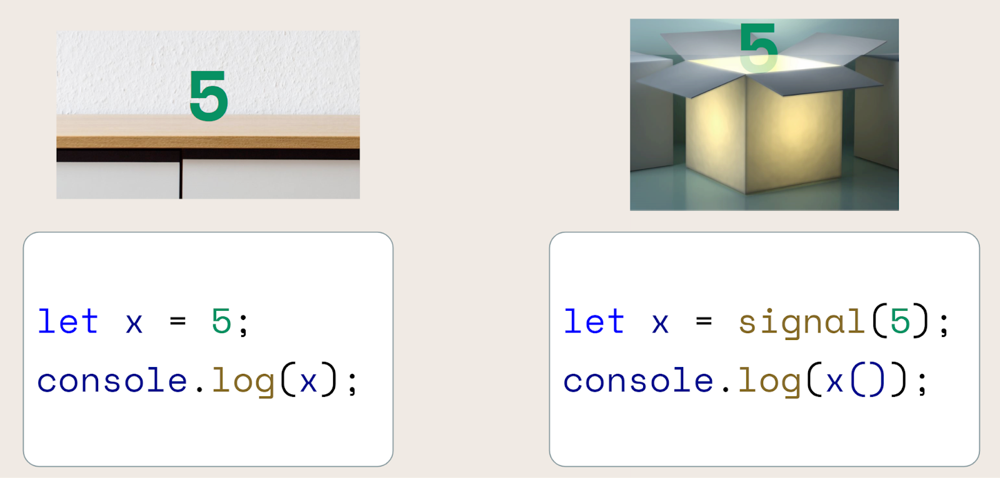
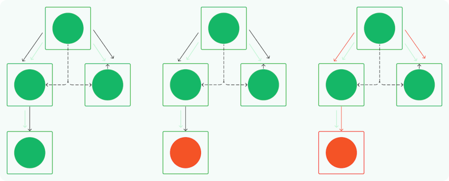
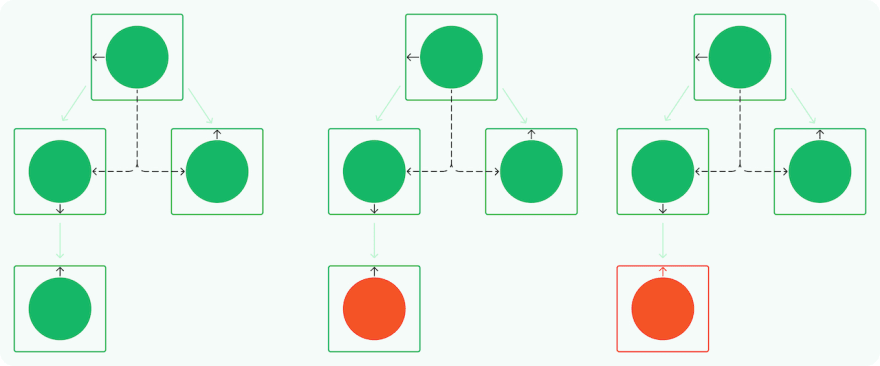

= Signals in Angular

== What Is a Signal?

A signal is more like a box, as shown on the right side of Figure 2.
Creating a signal metaphorically creates a box and puts the value inside of that box.
The box glows when the value of the signal changes. To read the signal, first open the box using parentheses: x().
Technically speaking, we call the signal's getter function to read the signal.

NOTE: A signal is a variable + change notification.

== How to Create a Signal

Example:

[source,typescript]
----

         mySignal = signal<number>(1);
----

== How to Change the Value of a Signal

In addition to the set(), there are two other ways to change a signal: update() and mutate().

Example:

[source,typescript]
----
        this.mySignal.set(2);
        // Update value based on current value
        this.mySignal.update(val => val * 2);
        // The mutate() method modifies the content of a signal value, not the signal value itself.
        this.signalObject.mutate((a:Auto) => v.price = v.price + (v.price * .20));

----

= How to Define a Computed Signal

Oftentimes we have variables in our code that depend on other variables.
For example, the total price for an item is the price for that item times the desired quantity of that item.
If the user changes the quantity, we want to change the total price. For that, we use computed signals.

Define a computed signal by calling the computed creation function.
The computed() function creates a new signal that depends on other signals.
Example:

[source,typescript]
----
       totalPrice = computed(() => this.selectedVehicle().price * this.quantity());

----

== How to Use an Effect

There may be times that you need to run code when a signal changes, and that code has side effects.
By side effects I mean code that calls an API or performs another operation not related to the signal. In these cases, you'll use an effect().

Example:

[source,typescript]
----
       effect(() => console.log(this.mySignal()));

----

== When to Use Signals

Here are some suggestions for when to use signals.

* First, continue to use event handlers in a component as you do now for user actions.
Actions such as a selection from a drop down list, a click on a button, or an entry in a textbox.

* Use a signal or a computed signal in a component for any state that could change.
In this context, state refers to any data that the component manages.
Everything from an isLoading flag to the current displayed "page" of data to the user's selected filter criteria could be signals.

* Signals are especially useful when displaying data in the template when that data should react to other actions.
* Put shared signals in a service if those signals are shared between components.

* Continue to use Observables for asynchronous operations, such as http.get(). There are more features coming to signals
to map a signal to and from an Observable.

== How Angular currently detects changes

We see that a model has changed inside our component tree, symbolized by the orange circle.
The model itself has no logical dependency on any other component.
As we enter a new change detection cycle the following happens:

* Angular starts at the top of the tree and begins to check that node
* It then continues to walk along the tree to determine which components need to be updated
* Finally, it reaches the component in which the model has changed.
* The equality check fails and the DOM is updated.

These steps happen every time change detection is triggered.

== Signal powered change detection

We have the same application with multiple components. Some models logically depend on each other, while others do not.
Their views are all connected through parent/child relationships within the DOM tree.

With signals, there is no need to create a tree that enables change detection.
The signals used in the template notify it of their changes. That's why in this abstraction the change detection
arrow is directly connected to the DOM node.

So what happens when the model changes?

The template is notified of this change and the DOM updates.

That's it.
image:img_1.gif[img_1.gif]

